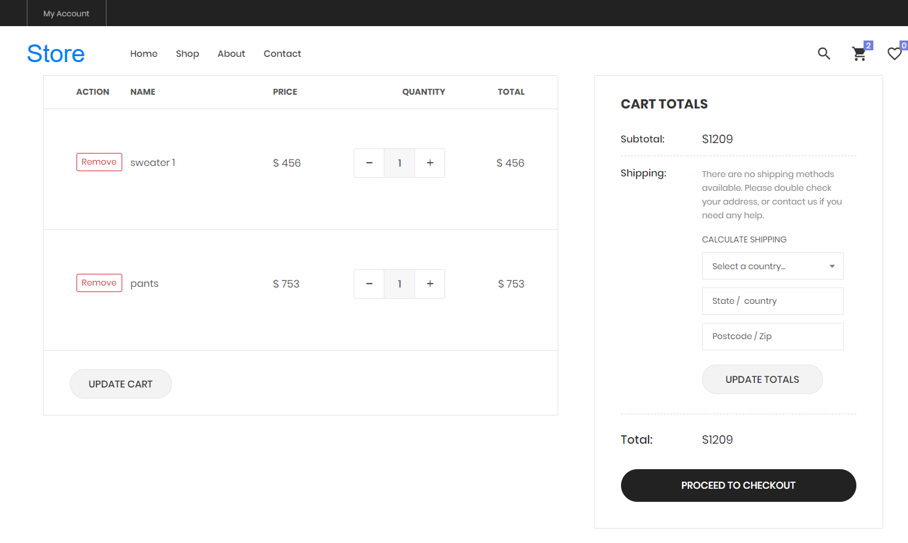
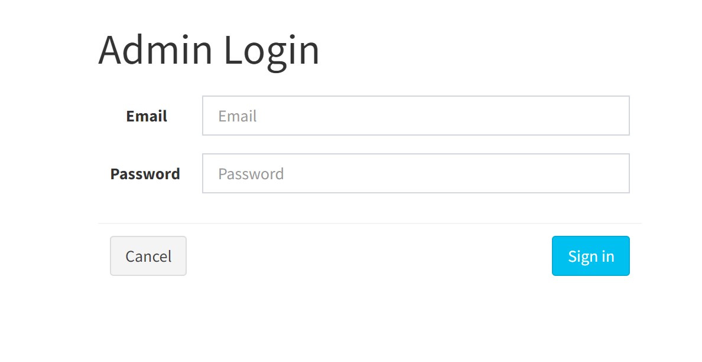
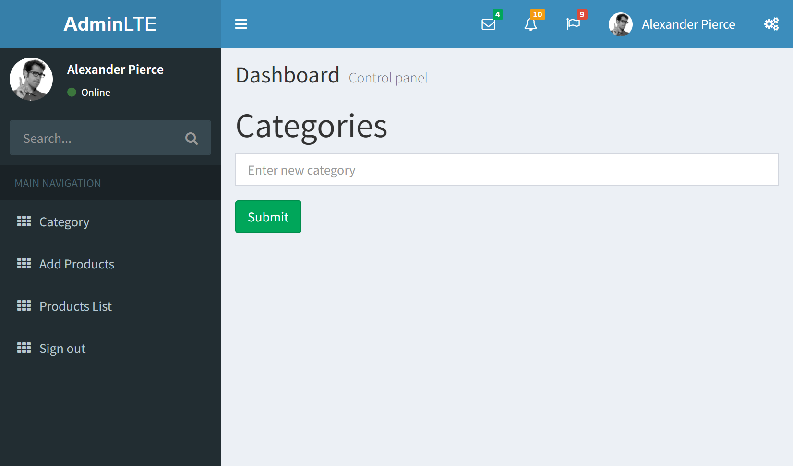
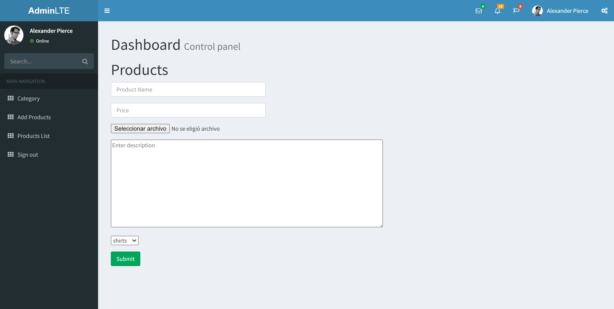

# Tienda-E-Commerce
Tienda E-Commerce Realizada con PHP y MYSQL
Sitio web de comercio electrónico desde cero creado con PHP y MySQL, puede recibir pedidos de clientes tiene carrito de compras y también incluye un panel de administradores. 

Demostracion de la pagina web: 

1. Pagina de Inicio de la tienda:

2. Carrito de compras:

3. Inicio de sesion para los administradores: 

4. Panel de administradores para crear una nueva categoria de productos:

5. Panel de administradores para agregar un nuevo producto a la base de datos: 

6. Estructura de la base de datos SQL en XAMPP: 

